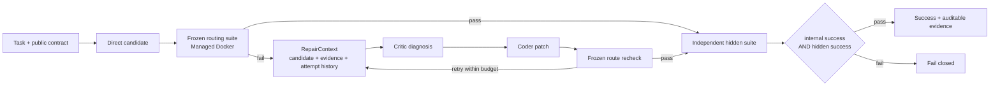

# Agent Loop Reflection v0.4

[](https://github.com/PVRTPVRT/agent-loop-reflection/actions/workflows/ci.yml)

一个可评测、可观测、成本感知的 Coding Agent 修复系统。它先用低成本 Direct
生成候选，在隔离 Docker 中执行冻结的公开路由套件；失败时把候选、测试和
expected/actual 证据交给 Critic 与 Coder 做有界修复，最后由独立隐藏集验收。

v0.4 在 v0.3 困难任务矩阵之上加入类型化 Artifact/Evaluation 边界、可信仓库
Fixture、Repository Patch 隔离验证与零 API Mutation Matrix；同时删除不可达历史路径，
把函数和仓库验证统一到同一个 Managed Docker 生命周期。

## 核心闭环



## 核心能力

- Direct、Lean Reflection、Adaptive 与明确标注的 Recorded Failure Replay
- OpenAI Responses API、Structured Outputs 和角色级调用预算
- Pydantic V2 不可变契约、`expected_exception` 与执行前公开契约校验
- 版本化 Dataset、Contract、Routing Suite、Oracle 与数据指纹
- Evidence-Driven Repair：失败候选和真实验证证据跨工作流传递
- Repair attempt history：后续轮次能看到此前补丁及其最新失败
- Managed Docker：非 root、只读文件系统、无网络、资源限制与强制清理
- Repository Patch 验证：完整 SHA-256 revision、快照复验、受保护测试与真实命令
- 零 API Repository Mutation Matrix：Easy/Hard 两个任务、正确修复与非修复对照
- 合取成功门控：内部修复失败不能被覆盖不足的隐藏集误判为成功
- 可选 OpenTelemetry：展示 Agent、模型、验证、Token 和耗时 Span，不记录密钥、
  prompt、生成代码或测试参数

## 安装

要求 Python 3.12 和 Docker Desktop：

```powershell
python -m venv .venv
.\.venv\Scripts\python.exe -m pip install -e ".[dev]"
Copy-Item .env.example .env
```

在 `.env` 中设置本地 `OPENAI_API_KEY`。`.env` 已被 Git 忽略。只有运行真实模型
实验才会产生 API 费用；测试套件和 Phoenix smoke 验证不调用模型。

若要启用 OpenTelemetry/Phoenix：

```powershell
.\.venv\Scripts\python.exe -m pip install -e ".[observability]"
.\scripts\start-phoenix.cmd
```

然后把 `.env.example` 中的 `AGENTLOOP_OTEL_*`、`OTEL_*` 与 `PHOENIX_*` 配置复制到
本地 `.env`，并将 `AGENTLOOP_OTEL_ENABLED` 改为 `true`。界面位于
<http://localhost:6006>。

## 运行

常规策略：

```powershell
.\scripts\run-v2.cmd direct
.\scripts\run-v2.cmd reflection
.\scripts\run-v2.cmd adaptive
```

安装为可编辑包后，也可以使用同一个 V2 入口：

```powershell
agentloop direct
agentloop reflection
agentloop adaptive
```

v0.3 困难任务矩阵与失败重放：

```powershell
.\scripts\run-v0.3-hard-matrix-pilot.cmd
.\scripts\run-v0.3-exact-natural-failure-replay.cmd
```

这些脚本会调用真实模型并产生费用。`repair-replay` 从已记录且可重现的错误候选开始，
用于验证 Repair 分支；它不会被计入自然失败率或自然通过率。

仓库级零 API Mutation Matrix：

```powershell
.\.venv\Scripts\python.exe -m pytest -q `
    tests\test_repository_docker_integration_v0_4.py `
    -k mutation_matrix
```

## 测试

```powershell
.\scripts\test-v2-managed.cmd
```

该命令不会调用 OpenAI API。当前门禁为：

```text
Ruff: passed
deterministic non-Docker tests: 130 passed
Docker integration tests: 8 passed
unique test functions in the release gate: 138
```

## 已验证结果

### v0.4 仓库级零 API Mutation Matrix

| Task | Difficulty | Correct patch | Non-fixing mutation |
|---|---|---:|---:|
| Calculator repair | Easy | pass | rejected |
| Chunked frame decoder | Hard | pass | rejected |

四个 Mutation 的预期与观察结果 4/4 一致；Fixture 使用完整 SHA-256 revision，
测试文件在 Patch 前后独立校验，执行镜像固定到 OCI digest。该结果证明仓库验证边界能
区分修复与表面改动，但尚未证明 LLM 能稳定生成仓库 Patch。

### v0.3 困难任务与失败历史

| Experiment | Result | Calls | Tokens | What it establishes |
|---|---:|---:|---:|---|
| Natural Adaptive hard matrix | 2/3 | 7 | 11,205 | Decoder 与 Ledger 直通过；TTL/LRU 真实触发 Repair 但仍失败 |
| Exact failure, prompt-only replay | 0/1 | 4 | 8,760 | 只强化提示仍未打断错误修复循环 |
| Exact failure, attempt-history replay | 1/1 | 4 | 9,967 | 保留失败尝试后修复并通过独立隐藏集 |

这是少量自然实验与受控重放，不具备统计显著性。它证明 Reflection 分支被真实调用、
失败证据能够进入修复，以及历史感知在这次记录故障上成功；它不证明 Reflection 在
所有任务或所有模型上必然优于 Direct。

### v0.2 闭环证据

| Experiment | Path | Result | Calls | Tokens |
|---|---|---:|---:|---:|
| R2 natural Adaptive | Direct | 1/1 | 1 | 751 |
| R2 recorded failure replay | Repair | 1/1 | 2 | 3,813 |

v0.2 还保留了一次隐藏集盲点造成的假阳性事故，并通过
`internal_success AND hidden_success` 合取门控将其封死。

### v0.1 成本基线

| Strategy | Result | Tokens/task | Duration/task |
|---|---:|---:|---:|
| Direct, 3×8 | 24/24 | 138.7 | 2.38 s |
| Lean Reflection, 3×8 | 18/24 | 2,486.2 | 49.43 s |
| Adaptive, 1×8 | 8/8 | 152.4 | 3.32 s |

简单任务基线说明优先 Direct 更经济，不代表困难任务上的统计优势。

## Python API

```python
from agentloop.v2 import (
    AdaptiveStrategyV2,
    EvidenceDrivenRepairWorkflow,
    ManagedDockerSandboxV2,
    RepairContext,
    RepairReplayStrategyV2,
    RepositoryBenchmarkDataset,
    RepositoryWorkspaceVerifier,
    run_repository_mutation_matrix,
)
```

## 证据边界

项目使用三类互补证据：

1. 测试套件验证确定性代码行为；
2. 版本化 JSON Benchmark 与 Trace 保存可复现实验事实；
3. OpenTelemetry/Phoenix 用于运行时排障和展示，不替代 Benchmark 统计。

当前 Oracle 仍依赖预注册公开契约，不能自动理解任意业务语义；自然 LLM 困难矩阵只有
三个函数任务，仓库矩阵只有两个确定性任务。项目尚未声称仓库级 LLM 修复具备统计优势；
该结论必须等待付费的重复 Direct/Adaptive Patch 实验。

## 文档

- [v0.4 仓库 Mutation Matrix 报告](docs/knowledge-base/experiments/2026-08-01-v0.4-repository-mutation-matrix.md)
- [作品展示：v0.3 架构与结果](docs/portfolio-showcase.md)
- [v0.3 困难矩阵与失败历史实验报告](docs/knowledge-base/experiments/2026-07-28-v0.3-hard-matrix.md)
- [OpenTelemetry / Phoenix 架构](docs/knowledge-base/architecture/opentelemetry.md)
- [Evidence-Driven Repair 架构](docs/knowledge-base/architecture/evidence-driven-repair.md)
- [v0.2 闭环实验与 R1 假阳性复盘](docs/knowledge-base/experiments/2026-07-28-v0.2-repair-closed-loop.md)
- [ADR-004：Managed Repository Verification](docs/knowledge-base/decisions/ADR-004-managed-repository-verification.md)
- [ADR-003：Artifact 与 Evaluation 边界](docs/knowledge-base/decisions/ADR-003-artifact-evaluation-boundary.md)
- [ADR-002：合取成功门控](docs/knowledge-base/decisions/ADR-002-conjunctive-success-gate.md)
- [安全执行决策](docs/knowledge-base/decisions/ADR-001-secure-execution.md)
- [测试说明](docs/knowledge-base/TESTING.md)
