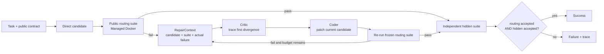

# Evidence-Driven Repair V2

v0.2 将 Adaptive 的失败分支从“重新运行一次 Reflection”改为“携带失败证据修复
现有候选”。核心目标不是增加 Agent 数量，而是保证失败信息不会在工作流边界丢失。

## 自然 Adaptive 路径



`RepairContext` 是不可变 Pydantic 模型，包含：

- `task_id`
- Direct 失败候选
- 预注册公开路由套件
- Docker Verifier 返回的 expected/actual 失败信息

Repair 模式不会调用 Tester 重新生成测试，也不会修改验收套件。第二轮修复从第一轮
候选继续，并根据最新验证失败重新运行 Critic，避免重复修补原始代码。

## 成功不变量

v0.2 的最终成功条件是：

```text
final_success = internal_route_acceptance AND independent_hidden_acceptance
```

这个合取门控来自 R1 事故：当 Repair 内部仍失败时，覆盖不足的隐藏集曾将同一错误
候选判为通过。原始结果被保留为 invalidated artifact，防回归测试确保这种假阳性
不能再次成为最终成功。

## Recorded Failure Replay

自然实验无法保证每次都触发 Reflection。为验证修复分支，v0.2 增加单独统计的
`repair-replay`：

1. 读取 R1 真实产生的失败候选；
2. 先在 Docker 中证明该候选仍然无法通过冻结路由套件；
3. 使用真实 Critic/Coder API 修复；
4. 同时通过公开路由与 R2 独立隐藏集才算成功。

这属于故障重放，不计入自然 Adaptive 成功率，也不用于宣称模型在困难任务上的自然
失败概率。

## 信任边界与限制

- 公开路由用例是修复证据，独立隐藏用例是最终泛化检查。
- Managed Docker 禁止网络、限制资源、使用只读文件系统并强制清理。
- 当前 Oracle 适用于有明确、可执行契约的确定性任务；它不是任意业务需求的通用
  语义判定器。
- v0.2 只有一个困难状态机任务，属于闭环工程证据，不具备跨任务统计显著性。
- 属性测试、变形测试、多文件 Patch 与真实仓库任务属于后续扩展方向。
