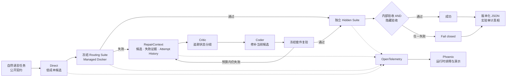
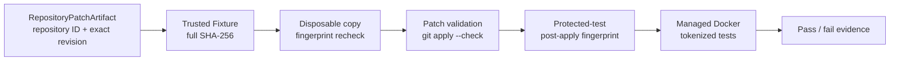
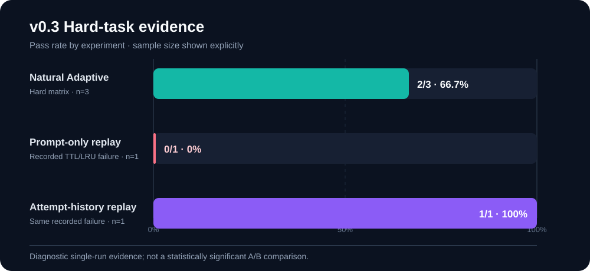

# Agent Loop Reflection v0.4：作品展示

本页用于项目快速评审。v0.4 没有增加更多 Agent，而是在 v0.3 困难任务闭环之外增加
类型化函数/仓库评测边界、可信 Fixture、零 API Mutation Matrix，并删除不可达历史路径。

## 系统架构

系统边界：

- LLM 负责提出候选、解释具体失败并生成补丁。
- 预注册套件与确定性 Verifier 负责验收，LLM 不能在修复时改测试。
- Docker 负责非 root、无网络、只读文件系统、资源限制和强制清理。
- Repair 的后续轮次能看到此前候选、补丁和最新失败，而不是重新抽奖。
- Phoenix 只展示安全的运行元数据；JSON Benchmark 与 Trace 才是版本化实验记录。

## v0.4 仓库评测边界

| Task | Difficulty | Correct patch | Non-fixing mutation |
|---|---|---:|---:|
| Calculator | Easy | pass | rejected |
| Chunked frame decoder | Hard | pass | rejected |

4/4 Mutation 与预注册期望一致。执行镜像固定到 OCI digest，Patch 不能修改或重命名
受保护测试，Docker 不可用时安全失败。该矩阵不调用模型，因此验证的是 Evaluator，
不是 LLM 仓库修复成功率。

## v0.3 困难任务矩阵

| Task | Main risk | Natural Adaptive | Calls | Tokens |
|---|---|---:|---:|---:|
| Chunked frame decoder | 粘包、半包、跨 chunk 边界、非法长度 | 通过 | 1 | 728 |
| Idempotent ledger | 重复 ID、冲突负载、拒绝结果缓存 | 通过 | 1 | 1,070 |
| TTL/LRU state machine | 过期顺序与 LRU 顺序不一致 | 失败 | 5 | 9,407 |
| **Total** | 三类不同状态约束 | **2/3** | **7** | **11,205** |

Frame Decoder 和 Ledger 在 Direct 路径通过。TTL/LRU 的公开路由套件真实拒绝了错误
候选，Adaptive 也真实进入 Critic/Coder 修复，但在调用预算内仍未修好。这条失败证明
路由分支不是摆设，同时也阻止项目把“进入 Reflection”等同于“Reflection 必然成功”。

## 失败历史的对照证据

从自然 TTL/LRU 运行保存的同一个失败候选出发：

| Replay | Result | Calls | Tokens | Observation |
|---|---:|---:|---:|---|
| Prompt-only | 0/1 | 4 | 8,760 | 继续保留“只从 LRU 队首清理过期项”的错误假设 |
| Attempt-history aware | 1/1 | 4 | 9,967 | 扫描全部条目并通过 6 个独立隐藏用例 |

这不是统计 A/B，也不是自然成功率。它是一组可审计的正反 Trace，说明本次记录故障中：
仅加强提示仍失败，而保留先前补丁及其失败证据后成功打断了错误循环。

## 为什么这些任务比基础算法更有价值

- Frame Decoder 需要维护跨 chunk 缓冲区，错误往往只在边界切分时出现。
- Idempotent Ledger 需要区分“重复同一请求”和“同 ID 不同负载”，还要缓存拒绝结果。
- TTL/LRU 同时存在访问顺序与过期时间两个排序维度，不能把 `OrderedDict` 队首当作
  最早过期项。

它们仍是单函数受控任务，但比 add、fibonacci、palindrome 更接近协议解析、支付幂等
与缓存状态机等真实工程风险。

## 可观测性

OpenTelemetry Span 覆盖 Direct、Critic、Coder、Verifier、Repair Workflow 和最终隐藏
验收，记录角色、模型、Token、耗时、轮次和成功状态。Span 刻意排除：

- API key；
- system/user prompt；
- 生成代码；
- 测试参数与 expected；
- Verifier 原始消息。

Phoenix 负责把 Span 树可视化，便于定位“哪一步失败、成本花在哪里”；它不参与路由、
修复或计分，也不替代版本化 JSON 报告。

## v0.2 仍然成立的闭环修复

v0.2 曾发现一次假阳性：内部 Repair 失败，但旧隐藏集没有覆盖同类缺陷，旧 evaluator
错误输出 `success=true`。项目没有删除事故数据，而是：

1. 将最终成功改为 `internal_success AND hidden_success`；
2. 增加“内部失败、隐藏通过也必须失败”的回归测试；
3. 增加独立于公开路由的隐藏场景；
4. 把原始结果标记为 invalidated false positive。

这使评测在隐藏集存在盲点时仍能 fail closed。

## 当前可以坚持与不能夸大的结论

可以坚持：

- 困难任务会真实触发 Adaptive 的 Repair 分支。
- 失败候选、验证证据和跨轮尝试历史不会丢失。
- 冻结公开套件与独立隐藏套件共同验收，内部失败无法被隐藏集盲点覆盖。
- 每次实验都有 Dataset 指纹、JSON 报告、逐任务 Trace 与安全的运行时 Span。
- 仓库评测能拒绝 stale Fixture、测试篡改和不修复行为，函数与仓库共用同一沙箱生命周期。
- 当前完整门禁为 130 项确定性测试和 8 项 Docker 集成测试。

不能夸大：

- 三个困难任务不能证明跨领域泛化或统计显著性。
- 单次 Prompt-only 与 History-aware 重放不能证明历史在所有模型上都有效。
- 当前 Oracle 依赖预注册契约，不能自动理解任意复杂业务语义。
- Phoenix 提高的是可解释性与排障效率，不直接提高模型正确率。
- 两个零 API 仓库任务不能证明 LLM 能生成正确 Patch，也不能证明 Adaptive 更优。

## 三分钟展示顺序

1. 用架构图解释 Direct 优先、失败才升级、最终合取验收。
2. 展示 v0.4 Repository Matrix 的 4/4 正反对照和完整 SHA-256 可信边界。
3. 展示 v0.3 Hard Matrix 的自然 `2/3`，主动指出 TTL/LRU 的真实失败。
4. 打开 TTL/LRU 的 Prompt-only 与 History-aware 两条 Trace 对照。
5. 在 Phoenix 中展开 Span 树，并以“Evaluator 已验证、仓库 LLM 实验未声称”收尾。

详细证据见：

- [v0.4 仓库 Mutation Matrix 报告](knowledge-base/experiments/2026-08-01-v0.4-repository-mutation-matrix.md)
- [v0.3 困难矩阵与失败历史实验报告](knowledge-base/experiments/2026-07-28-v0.3-hard-matrix.md)
- [OpenTelemetry / Phoenix 架构](knowledge-base/architecture/opentelemetry.md)
- [Evidence-Driven Repair 架构](knowledge-base/architecture/evidence-driven-repair.md)
- [v0.2 闭环实验与假阳性复盘](knowledge-base/experiments/2026-07-28-v0.2-repair-closed-loop.md)
- [ADR-002：合取成功门控](knowledge-base/decisions/ADR-002-conjunctive-success-gate.md)
