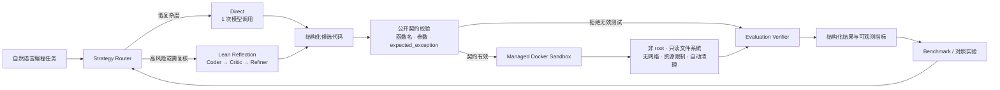

# Agent Loop Reflection：作品展示

本页用于面试讲解和项目快速评审。所有实验数字均来自仓库内已版本化的
`coding-v2-full` Benchmark 结果，而不是手工估算。

## 系统架构

架构的核心不是“让模型多思考几轮”，而是将策略选择、契约验证、安全执行和
可观测评测拆成独立边界。Adaptive 策略可以根据任务路由到 Direct 或 Reflection，
并由同一套公开测试契约和 Docker 沙箱统一验收。

## 实验结果

### 读图结论

- Direct 在当前 8 个小型确定性编程任务上最有效：三次实验均为 100% 通过，
  平均耗时 2.38 秒、平均 138.7 tokens。
- Lean Reflection 的三次平均通过率为 75%，平均耗时 49.43 秒、平均
  2486.2 tokens；主要失败来自 API timeout，说明“更多推理”不等于更高可靠性。
- Adaptive 单次路由实验达到 100% 通过，平均耗时 3.32 秒、平均
  152.4 tokens，但只有一次运行，不能据此宣称统计上优于 Direct。

## 实验口径

| 项目 | 口径 |
|---|---|
| 数据集 | `coding-v2-full`，8 个任务 |
| 数据指纹 | `d7b5dbf39799f570` |
| 模型 | Nano 级低成本模型 |
| Direct | 3 次重复实验的均值 |
| Lean Reflection | 3 次重复实验的均值 |
| Adaptive | 1 次路由实验，仅作为工程可行性证据 |
| 通过标准 | 公开契约校验后，在隔离沙箱中通过全部测试 |

原始数据位于 `benchmarks/results/`，详细分析见
[重复实验报告](knowledge-base/experiments/2026-07-27-v2-repeated-results.md) 与
[Adaptive 实验报告](knowledge-base/experiments/2026-07-28-adaptive-v2-result.md)。
