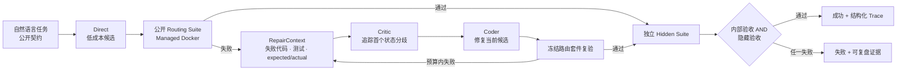
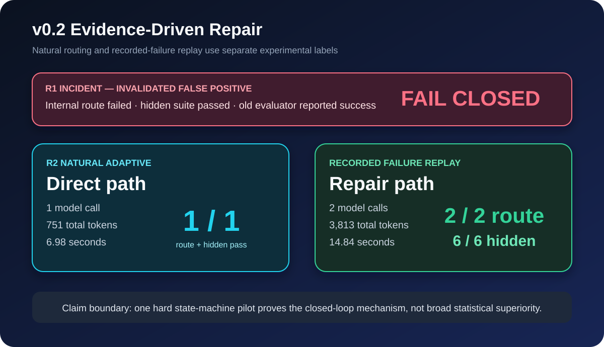
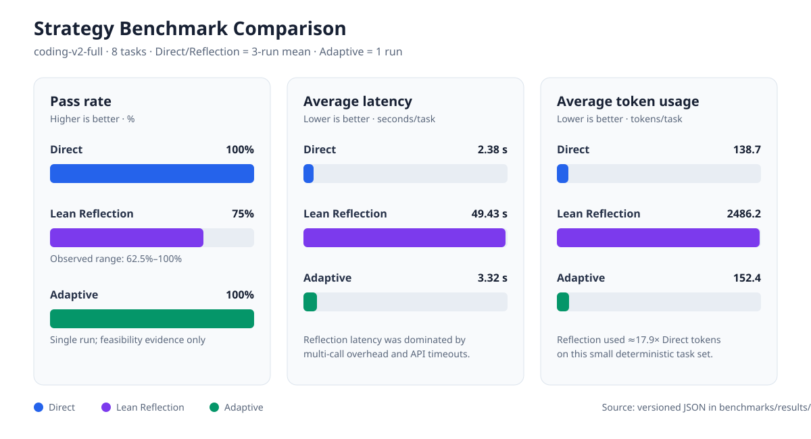

# Agent Loop Reflection v0.2：作品展示

本页用于项目快速评审。v0.2 的重点不是“堆叠多个 Agent”，而是让一次真实代码失败
能够携带证据进入修复、通过冻结验收，并对误判 fail closed。

## 系统架构

系统边界：

- LLM 负责提出候选、解释具体失败和生成补丁。
- 预注册套件与确定性 Verifier 负责验收，LLM 不能在修复时改测试。
- Docker 负责非 root、无网络、只读文件系统、资源限制和强制清理。
- 第二轮 Repair 从第一轮候选继续，并根据最新失败重新诊断。

## v0.2 结果

| Experiment | Purpose | Calls | Tokens | Acceptance |
|---|---|---:|---:|---|
| R2 natural Adaptive | 测量自然路由与成功路径成本 | 1 | 751 | route 2/2, hidden 6/6 |
| R2 recorded failure replay | 可复现验证 Repair 分支 | 2 | 3,813 | route 2/2, hidden 6/6 |

Recorded Failure Replay 使用 R1 真实产生的错误模式：代码将 `OrderedDict` 的 LRU
顺序错误地当作过期时间顺序，导致非队首过期条目没有被删除。Critic 逐事件追踪后
定位根因，Coder 一轮修复，最终同时通过公开路由和独立 R2 隐藏集。

## 为什么 R1 失败比一条漂亮结果更重要

R1 的 Direct 被公开路由正确拒绝，Repair 也未修好，但旧隐藏集恰好没有覆盖同类
缺陷。旧 evaluator 因为只看隐藏结果，错误输出 `success=true`。

v0.2 没有删除这条失败数据，而是：

1. 将最终成功改为 `internal_success AND hidden_success`；
2. 增加“内部失败、隐藏通过也必须失败”的回归测试；
3. 增加一个不同于公开路由用例的 R2 隐藏场景；
4. 把原始结果标记为 invalidated false positive。

这使项目展示的重点从“我跑出了 100%”变为“系统能发现并封死自己的误判路径”。

## v0.1 成本基线

| Strategy | Result | Tokens/task | Duration/task |
|---|---:|---:|---:|
| Direct, 3×8 | 24/24 | 138.7 | 2.38 s |
| Lean Reflection, 3×8 | 18/24 | 2,486.2 | 49.43 s |
| Adaptive, 1×8 | 8/8 | 152.4 | 3.32 s |

这些数字说明简单任务优先 Direct 更经济；它们不证明 Reflection 在广泛任务上具有
统计优势。v0.2 用困难状态机补上了一条真实修复链，但仍只有单题证据。

## 面试中可以坚持与不能夸大的结论

可以坚持：

- Direct 失败证据不会丢失，Repair 针对现有候选而非重新抽奖。
- 记录故障可被 Docker 重放、真实 API 修复并由双重套件验收。
- 成功门控对隐藏集盲点 fail closed。

不能夸大：

- 当前 Oracle 不能自动理解任意复杂业务语义。
- 单个 TTL/LRU 任务不能证明跨领域泛化或统计显著性。
- Repair Replay 是故障重放，不是自然失败率实验。

详细证据见
[v0.2 闭环实验报告](knowledge-base/experiments/2026-07-28-v0.2-repair-closed-loop.md)、
[Evidence-Driven Repair 架构](knowledge-base/architecture/evidence-driven-repair.md) 和
[ADR-002](knowledge-base/decisions/ADR-002-conjunctive-success-gate.md)。
